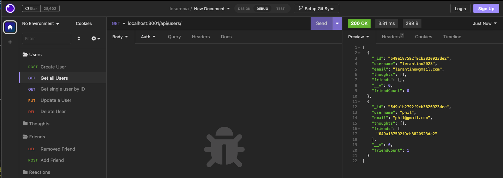
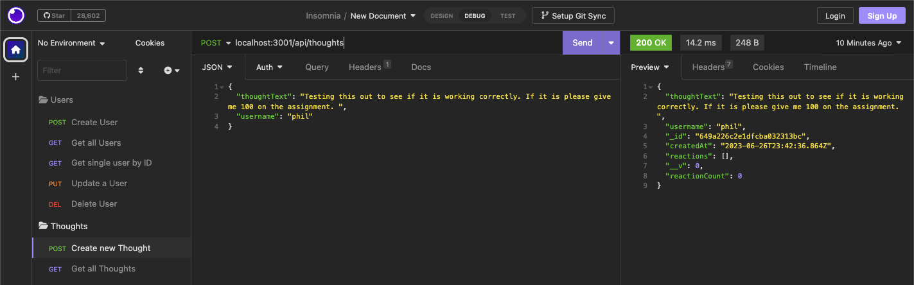

# Run-Media

## Description

This application is a backend API for a social media application. It utilizes express, mongoose, and mongoDB to create a database that can be used to create, update, and delete users, thoughts, and reactions.

## Installation

In order to use this application you will need to have node installed on your machine. You will also need to have mongoDB and install the necessary dependancies. To install the dependancies you will need to run the following command in your terminal: npm i express mongoose. You will also need to install insomnia in order to test the routes. 

## Usage

In order to use this application, once it is running you will utilize insomnia to make get, posts, puts, or deletes in order to update your social media database. 

## Credits

N/A

## License

MIT License

Copyright (c) [2023] 

Permission is hereby granted, free of charge, to any person obtaining a copy
of this software and associated documentation files (the "Software"), to deal
in the Software without restriction, including without limitation the rights
to use, copy, modify, merge, publish, distribute, sublicense, and/or sell
copies of the Software, and to permit persons to whom the Software is
furnished to do so, subject to the following conditions:

The above copyright notice and this permission notice shall be included in all
copies or substantial portions of the Software.

THE SOFTWARE IS PROVIDED "AS IS", WITHOUT WARRANTY OF ANY KIND, EXPRESS OR
IMPLIED, INCLUDING BUT NOT LIMITED TO THE WARRANTIES OF MERCHANTABILITY,
FITNESS FOR A PARTICULAR PURPOSE AND NONINFRINGEMENT. IN NO EVENT SHALL THE
AUTHORS OR COPYRIGHT HOLDERS BE LIABLE FOR ANY CLAIM, DAMAGES OR OTHER
LIABILITY, WHETHER IN AN ACTION OF CONTRACT, TORT OR OTHERWISE, ARISING FROM,
OUT OF OR IN CONNECTION WITH THE SOFTWARE OR THE USE OR OTHER DEALINGS IN THE
SOFTWARE.

